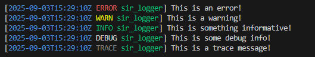
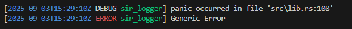

# sir_logger
This is a simple crate that I tend to use in a lot of projects. I used to just copy the crate between all of my projects and after the 8th time, I have decided to just open-source the thing.

This is just a somewhat personalized version of [env_logger](https://crates.io/crates/env_logger), [env_logger](https://crates.io/crates/env_logger) is better in almost every way.

**Note**: 
- This library will only give `warn` and `error` logs for other libraries unless set to `trace`.
- If using the log file, this library **WILL** include the ansi coloring in the log file.
- This is not a serious project, please don't use it in production without checking it over.

## Features

- Panic handler to include panics in the logs (disable with the `no-panic-handler` feature)
- Fetching logging level from either the environment or the program itself.
- Log file support

## Example

```rust
fn main() {
    sir_logger::setup(
        // The log filter override, if `Some(value)`,
        // the logger will use that value as the log level displayed.
        // If `None`, then the logger will try to find the value in
        // `RUST_LOG`, and then it'll default to `INFO`
        Some(LevelFilter::Trace),

        // The names of crates that should be disabled for the logger
        ["very_verbose_crate"],

        // The names of libraries that should be at the same log
        // level as the main program.
        ["super_important_crate"],

        // A path to a file to store logs, or `None`
        Some("path/to/log.txt"),

        // The name of this executable, this'll help the library
        // set the correct log level for all crates.
        env!("CARGO_PKG_NAME")
    );
}
```

## Screenshots

### General use


### Panic support

