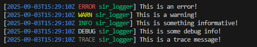
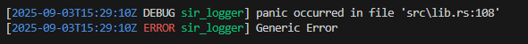

# sir_logger

[](https://crates.io/crates/sir_logger) [](https://docs.rs/sir_logger)

This is a simple crate that I tend to use in a lot of projects. I used to just copy the crate between all of my projects and after the 8th time, I have decided to just open-source the thing.

This is just a somewhat personalized version of [env_logger](https://crates.io/crates/env_logger), [env_logger](https://crates.io/crates/env_logger) is better in almost every way.

## Note

- This library will only give `warn` and `error` logs for other libraries that are not internal unless set to `trace`.
- If using the log file, this library **WILL** include the ansi coloring in the log file.
- This is not a serious project, please don't use it in production without checking it over.

## Usage

The logger will default to using the `RUST_LOG` env var or `INFO` if no `log_level` is set.

```rust
sir_logger::setup!()
    // Configure the logger to use stdout and stderr
    .use_stdout()
    .use_stderr()

    // Also output to "./log.txt"
    .log_file("log.txt")
    .unwrap()

    // Make tracing shut up
    .suppress(["tracing"])

    // Set the log level for `important_library` and `other_important_library` to the same as this library
    .internal(["important_library", "other_important_library"])

    // Finally setup the logger
    .setup()
    .unwrap();
```

## Screenshots

### General use



### Panic support


